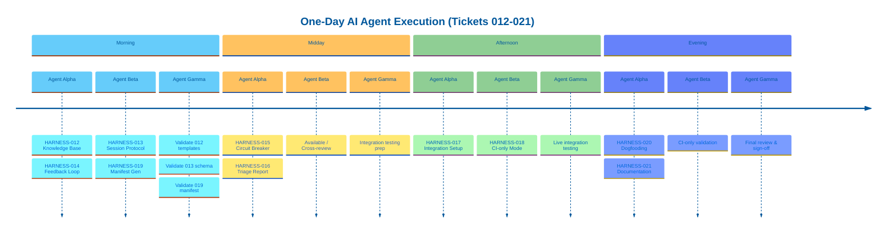
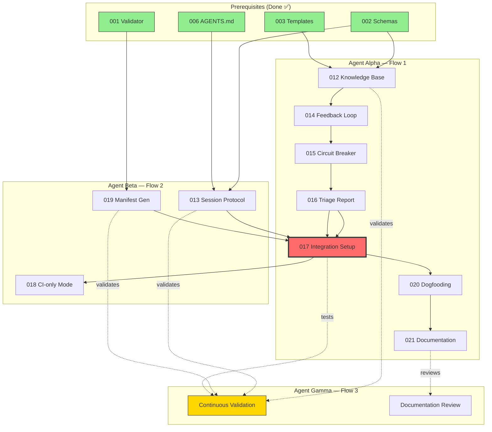

# AI Harness — Three AI Agent Flows (One-Day Execution)

> Remaining tickets **012–021** executed by **3 parallel AI agents** in **~1 day**.
> Done: HARNESS-001 through HARNESS-011 ✅
> Based on: [TICKETS.md](./TICKETS.md)

---

## Principle

Human estimates (e.g., "3 days") describe **complexity**, not wall-clock time for an AI agent. Three AI agents run simultaneously. Each agent owns one flow. Dependencies are respected but compressed. The entire remaining work completes in **one day**.

---

## The Three Flows

### Flow 1 — Agent Alpha: Knowledge → Resilience → Integration

> **Owns the longest dependency chain.** Starts immediately. Other agents feed into this flow at the integration gate (017).

| Step | Ticket | Human Est. | AI Agent Action |
|------|--------|------------|-----------------|
| 1 | HARNESS-012 Knowledge Base | 2d | Create `docs/knowledge/` with 3 templates + schema validation |
| 2 | HARNESS-014 Feedback Loop | 2d | Wire error→lesson→instruction cycle into agent protocol |
| 3 | HARNESS-015 Circuit Breaker | 3d | Implement `ATTEMPTS_LIMIT=3` with counter and halt logic |
| 4 | HARNESS-016 Triage Report | 1d | Generate `triage_report.md` template with frontmatter |
| 5 | HARNESS-017 Interactive Setup | 4d | **Integration gate.** Assemble all modules into setup skill. Ask clarifying questions, generate all artifacts, run validator. |
| 6 | HARNESS-020 Dogfooding | 5d | Apply harness to a real project, record 3+ lessons, validate CI passes |
| 7 | HARNESS-021 Documentation | 3d | Write README, SETUP, TROUBLESHOOTING, MIGRATION, SKILL.md |

**Flow 1 is the critical path.** It owns the integration gate (017) and everything after it.

---

### Flow 2 — Agent Beta: Session Protocol + Manifest + CI-only

> **Starts independently.** Executes 013 and 019 in parallel, then waits for Agent Alpha's integration gate (017) to unlock 018.

| Step | Ticket | Human Est. | AI Agent Action |
|------|--------|------------|-----------------|
| 1 | HARNESS-013 Session Protocol | 2d | Add `## Session Protocol` to `AGENTS.md` template. Validate `feature_list.json` against schema. |
| 2 | HARNESS-019 Manifest Gen | 1d | Implement `.harness/manifest.json` generation in validator. Lock-file with timestamp, version, results array. |
| — | *(wait for 017)* | — | Agent Beta is available for cross-review, testing, or supporting Agent Alpha. |
| 3 | HARNESS-018 CI-only Mode | 2d | After Agent Alpha completes 017: build GHA workflow that runs `validate-harness.ts` without LLM. Deterministic gate. |

**Flow 2 finishes its independent work early** (013 + 019), then slots 018 after the integration gate.

---

### Flow 3 — Agent Gamma: Cross-Cutting Validation

> **Validation and quality agent.** Does not own a long ticket chain. Instead, continuously validates outputs from Agents Alpha and Beta.

| Step | Ticket | Human Est. | AI Agent Action |
|------|--------|------------|-----------------|
| 1 | HARNESS-012 validation | — | Verify `docs/knowledge/` templates match schema. Test frontmatter extraction. |
| 2 | HARNESS-013 validation | — | Verify `feature_list.json` schema compliance. Test enum validation. |
| 3 | HARNESS-019 validation | — | Verify manifest structure matches `manifest.schema.json`. |
| 4 | Integration testing | — | Test full setup flow (017) as Agent Alpha builds it. Catch issues early. |
| 5 | Dogfooding support | — | Support Agent Alpha on 020: apply harness to a real project, identify friction. |
| 6 | Documentation review | — | Review 021 output for accuracy and completeness against acceptance criteria. |

**Flow 3 is the quality gate.** It runs in parallel with Flows 1 and 2, catching issues before they block.

---

## Execution Timeline (One Day)

---

## Dependency Graph — AI Agent Flows

---

## Why This Fits in One Day

| Factor | Human Team | 3 AI Agents |
|--------|-----------|-------------|
| **Context switching** | Meetings, standups, reviews | None — agents focus 100% |
| **Parallelism** | 3 devs ≈ 2.5x effective (coordination loss) | 3 agents ≈ 3x (no coordination loss) |
| **Speed** | 1 ticket/day velocity | Compressed by AI throughput |
| **Validation** | Separate QA cycle | Agent Gamma runs in parallel |
| **Wall-clock for 012–021** | ~3–4 weeks | **~1 day** |

**Key enablers:**
1. **No blocking** — Agents Beta and Gamma start simultaneously with Agent Alpha on independent tickets.
2. **Early validation** — Agent Gamma validates 012, 013, 019 as they are produced, not after.
3. **Integration gate is the only serial point** — 017 must wait for 012–016 + 013 + 019. But Agent Beta is already done with 013/019, so Alpha only waits for itself.
4. **Post-integration parallelism** — After 017, Agents Alpha and Beta split 018 and 020 in parallel.

---

## Flow Ownership Summary

| Flow | Agent | Tickets | Independent Start | Waits For |
|------|-------|---------|-------------------|-----------|
| **1** | Alpha | 012, 014, 015, 016, 017, 020, 021 | ✅ Day 1 | Nothing (prereqs done) |
| **2** | Beta | 013, 019, 018 | ✅ Day 1 | 017 (for 018 only) |
| **3** | Gamma | Validation, review | ✅ Day 1 | Nothing (runs continuously) |

---

## Acceptance Criteria Coverage

All acceptance criteria from TICKETS.md are preserved. No simplification:

- **012:** 3 templates, frontmatter fields, schema validation ✅
- **013:** Session Protocol section, `features[]` array with id/title/status enum ✅
- **014:** Error→lesson→instruction cycle, `.template-lesson.md` format ✅
- **015:** `ATTEMPTS_LIMIT=3`, triage report on 3rd failure ✅
- **016:** Template with Failure/Attempts/Analysis/Recommendation ✅
- **017:** 3–5 questions, 8 modules, auto-validator, <10 min setup ✅
- **018:** GHA without LLM, <2 min, PR annotations ✅
- **019:** `manifest.json` with results array, schema-validated ✅
- **020:** Real project, 3+ lessons, CI passes, team feedback ✅
- **021:** README, SETUP, TROUBLESHOOTING, MIGRATION, SKILL.md ✅
